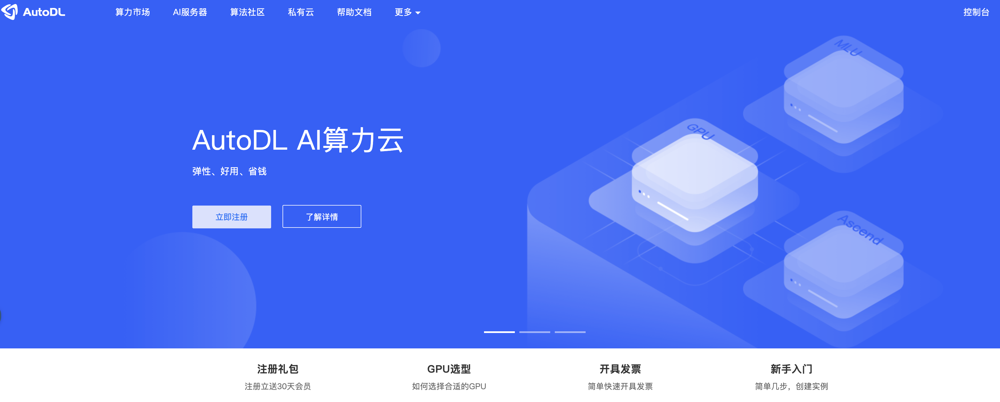

Transformer（对 seq2seq 自然语义模型进行改写）


- Bert：特征提取（判别模型）
- GPT：数据还原（生成模型）


**模型微调模式**

- 全量微调：对所有的参数进行微调，要求算力和显存，但是效果最好。（对于全量微调不一定是有效的，微调后的模型效果可能会变差）
- 局部微调：只调整某些局部参数，例如输出层，输入层或某些特殊层。对算力和显存要求一般
- 增量微调：通过新增参数的方式进行微调，新的知识存储在新的参数中。对显存和算力要求第，效果不如局部微调和全量微调。


操作系统选择：Ubuntu 22.04 版本


---

## 服务算力租赁

- 官网地址：https://www.autodl.com/




显卡驱动查看命令：

```
nvidia-smi
```


使用 SSH 远程连接到服务器上（使用 VSCode 或者 IDEA 自带 SSH 插件连接即可）


服务器文件传输，推荐使用 FTP等文件传输工具。（传输大文件）


查看 GPU 资源情况：

```
pip install nvitop
```

使用 nvitop 查看设备信息

```
nvitop
```


后台执行训练：

```
nohup python train.py &
```


查看 CPU 执行情况：

```
top
```


