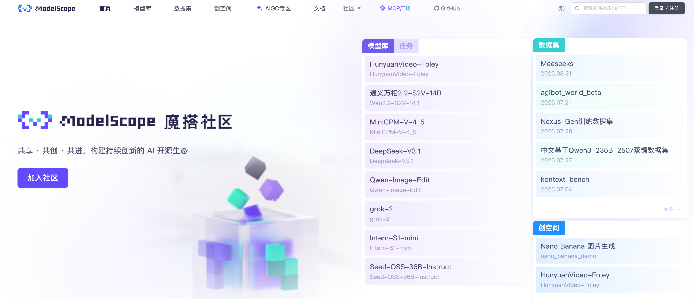
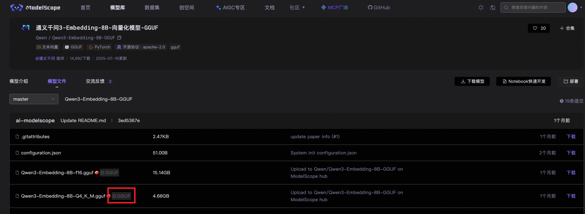
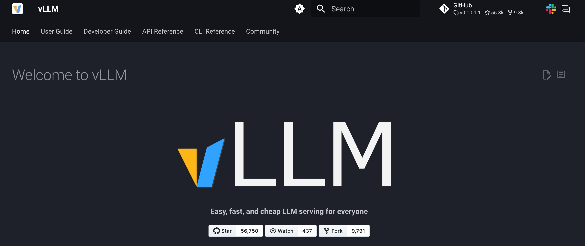
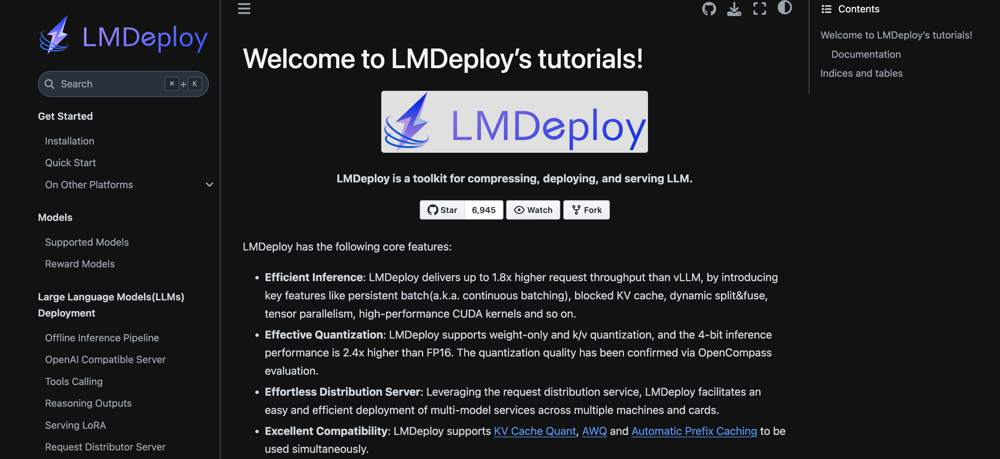

# 模型部署


## 魔塔社区

https://www.modelscope.cn/home




`Qwen3-0.6B` 模型 `config.json` 模型配置文件：

```
{
  "architectures": [
    "Qwen3ForCausalLM"
  ],
  "attention_bias": false,
  "attention_dropout": 0.0,
  "bos_token_id": 151643,
  "eos_token_id": 151645,
  "head_dim": 128,
  "hidden_act": "silu",
  "hidden_size": 1024,
  "initializer_range": 0.02,
  "intermediate_size": 3072,
  "max_position_embeddings": 40960,
  "max_window_layers": 28,
  "model_type": "qwen3",
  "num_attention_heads": 16,
  "num_hidden_layers": 28,
  "num_key_value_heads": 8,
  "rms_norm_eps": 1e-06,
  "rope_scaling": null,
  "rope_theta": 1000000,
  "sliding_window": null,
  "tie_word_embeddings": true,
  "torch_dtype": "bfloat16",
  "transformers_version": "4.51.0",
  "use_cache": true,
  "use_sliding_window": false,
  "vocab_size": 151936
}
```

大模型的默认（ `torch_dtype` ）数据类型 float32（单精度）

精度量化（模型量化）：减小模型体积、提高模型推理速度。

模型参数量 * 模型数据类型大小 = 模型文件大小


## Ollama 部署


https://ollama.com/


创建虚拟环境：

```
conda create -n 虚拟环境名 python=指定Python版本
```

激活虚拟环境：

```
conda active 虚拟环境名
```


Ollama 默认端口 11434。

Ollama 仅支持 GGUF 的模型文件（GGUF 通常是被量化后的模型，Ollama 部署通常针对个人用户使用）




Ollama 提高 API 服务（接口 API OpenAI API 风格）

```python
from openai import OpenAI

# 创基基于OpenAI API风格的API请求Client
client = OpenAI(base_url="http://localhost:11434/v1", api_key="<KEY>")

# 构建请求Prompt
chat_completion = client.chat.completions.create(messages=[
    {"role": "user", "content": "你好，请介绍一下自己"}
], model="qwen3:0.6b")

# 解析推理结果
response = chat_completion.choices[0]

print(response)

```


## vLLM 部署



https://docs.vllm.ai/en/latest/


安装 vLLM，基于 CUDA（最好是在Linux环境上进行部署运行）


## LMDeploy 部署


https://internlm.intern-ai.org.cn/



- Github地址：https://github.com/InternLM/lmdeploy
- 官方文档：https://lmdeploy.readthedocs.io/en/latest/


GPU 相关知识：GPU 查看 CUDA 数量，看显存大小


