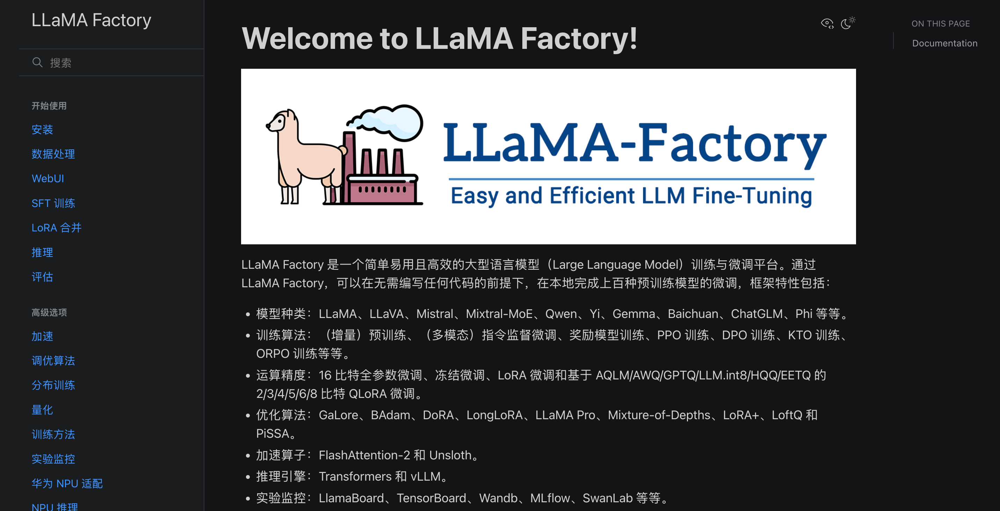

# 大模型微调

## LoRA 微调

LLama Factoty 模型微调框架

LoRA（Low Rank Adaptation）是一种用于大模型的微调技术（局部微调），通过引入低秩矩阵

### LLama Factory

https://github.com/hiyouga/LLaMA-Factory

https://llamafactory.readthedocs.io/zh-cn/latest/

检查点路径：训练后保存的权重

