# 图解 Transformer 

原文地址：https://jalammar.github.io/illustrated-transformer/

---

## A High-Level Look 总览

让我们先从将模型视为一个独立的黑箱（The Transformer）开始分析。在机器翻译应用中，它会接收一个语言的句子，然后输出其对应的另一种语言的翻译结果。


打开那个 Optimus Prime（擎天柱，Transformer） 装置后，我们看到了一个编码组件、一个解码组件，以及它们之间的连接关系。

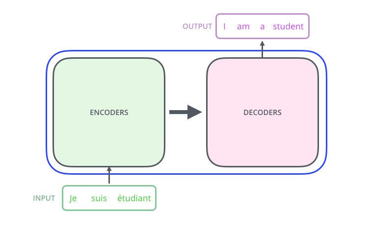

能看到整个 Transformer 是由两部分组成，一部分是 Encoder（编码器组件），另一部分是 Decoder（解码器组件）。
它们在结构上同构（都由多头注意力和前馈网络堆叠），却在功能、信息流向和注意力机制上有着本质区别。

简单概括：Encoder 负责“理解”输入，是双向的双目；Decoder 负责“生成”输出，是带“记忆”的单向盲人画家。

- Encoder（编码器）—— 双向的上下文理解器：将输入的原始词向量序列（如一句话）转化为富含上下文语义的深度特征表示。
- Decoder（解码器）—— 自回归的生成器：接收 Encoder 输出的特征，结合已经生成的“目标端前缀词”，自回归地逐个预测下一个输出词（如翻译后的句子）。

编码器和解码器是以相同数量分别组成，论文中将这些编码器堆叠在一起，共六个——数字六本身并没有什么特殊含义，当然也可以尝试使用其他排列方式


这些编码器在结构上是完全相同的（不过它们并不共享权重）。每个编码器又被分解为两个子层：

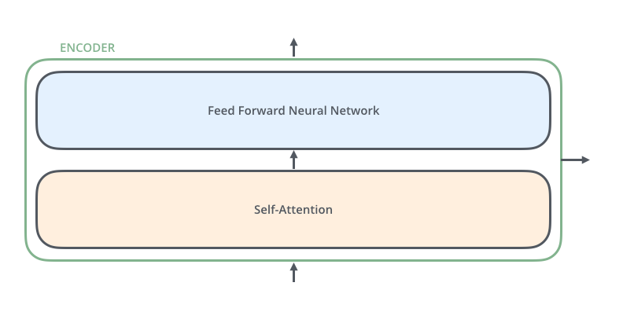

- Encoder 编码器的输入首先会经过一个自注意力层，这个层有助于编码器在编码某个特定单词时，也能考虑输入句子中的其他单词。我们会在后面的文章中详细讨论自注意力机制。
自注意力层的输出被输入到前馈神经网络中。同样的前馈网络被独立应用于每个位置。
- Decoder 解码器同时包含这两层结构，但在它们之间有一个注意力层，该层有助于解码器专注于输入句子中相关的部分（类似于在 seq2seq 模型中注意力机制的作用）。


> 现在理解了整个 Transformer 的整体结构，主要核心是分为两个部分：Encoder 和 Decoder（多层）。
> 
> - Encoder 作为输入端，（每一个 Encoder）内部是两层结构：Self-Attention 自注意力层 + 前馈神经网络 
> - Decoder 作为输出端，（每一个 Decoder）内部是三层结构：Self-Attention 自注意力层 + Encoder-Decoder Attention 层（交叉注意力（Cross-Attention）”层） + 前馈神经网络

---

## Bringing The Tensors Into The Picture 将张量引入到分析中

现在我们已经了解了该模型的主要组成部分，接下来让我们来探讨各种向量/张量是如何在各个组件之间相互流动的，以及如何将训练好的模型的输入转化为输出结果。

就像在自然语言处理中的其他应用场景一样，我们首先使用嵌入算法将每个输入单词转换为向量形式。

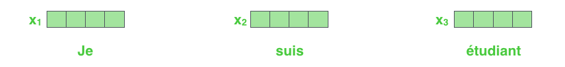

PS：每个单词都被嵌入到一个大小为 512 的向量中。我们可以用这些简单的方框来表示这些向量。

这种嵌入操作只发生在最下方的编码器中。所有编码器共有的一个特性是：它们接收一个向量列表，每个向量的长度为 512。
在最下方的编码器中，这些向量代表的是单词的嵌入表示；
而在其他编码器中，则代表的是直接下方的编码器的输出结果。
这个列表的长度是一个可以设置的超参数——实际上，这个长度应该等于我们训练数据集中最长句子的长度。

> "嵌入操作只发生在最下方"：把单词变成数字（512维向量）的查字典动作，只在第一层编码器（最底部）的入口处执行一次。
> 
> "所有编码器都接收向量列表"：
> - 列表的长度（箱子的个数）：等于句子中单词的数量（比如句子有 10 个词，列表里就有 10 个箱子）。 
> - 向量的长度（每个箱子的尺寸）：固定为 512（这是超参数，每箱必须装 512 维数据）。

当这些词被嵌入到我们的输入序列中后，每个词都会经过编码器的两层结构。

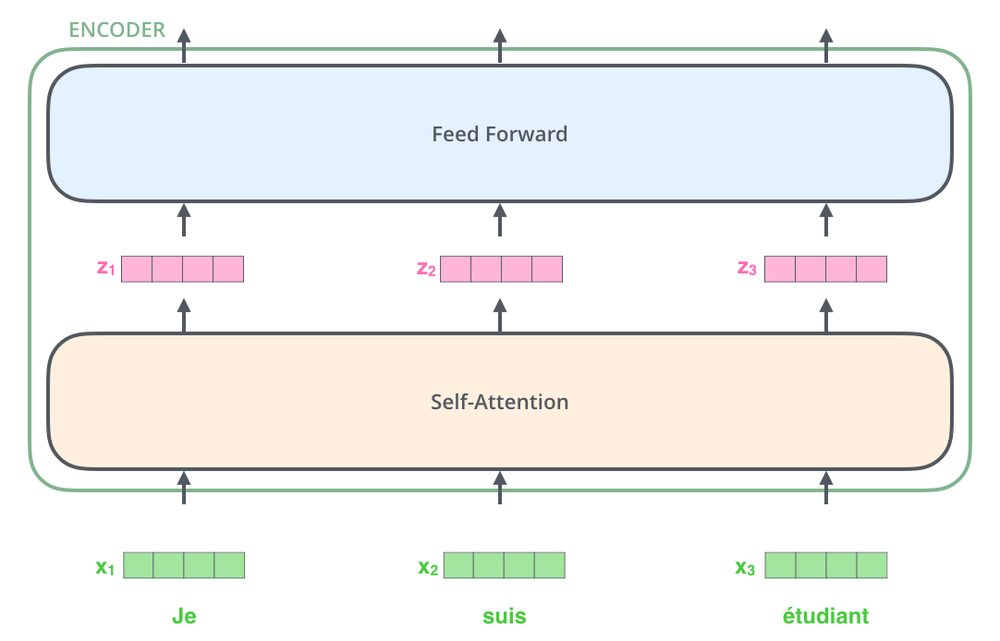

现在我们开始注意到 Transformer 的一个关键特性：每个位置上的单词都会沿着自己的路径在编码器中进行处理。在自注意力层中，这些路径之间存在依赖关系。
而在前向层，这些依赖关系并不存在，因此各个路径可以在经过前向层的同时并行处理。

> 前馈网络层（FFN）
> 
> Transformer 的设计哲学极其聪明：“只在必须交流的时候（自注意力）强制集体同步，一旦交流完毕，立刻各自为战（FFN），充分利用 GPU 的大规模并行算力。”
>

---

## Now We’re Encoding! Encoder 层

正如我们之前提到的，编码器接收到一个向量列表作为输入。它会将这些向量传递给“自注意力”层进行处理，然后再进入前馈神经网络。最后，输出结果会被传递给下一个编码器。

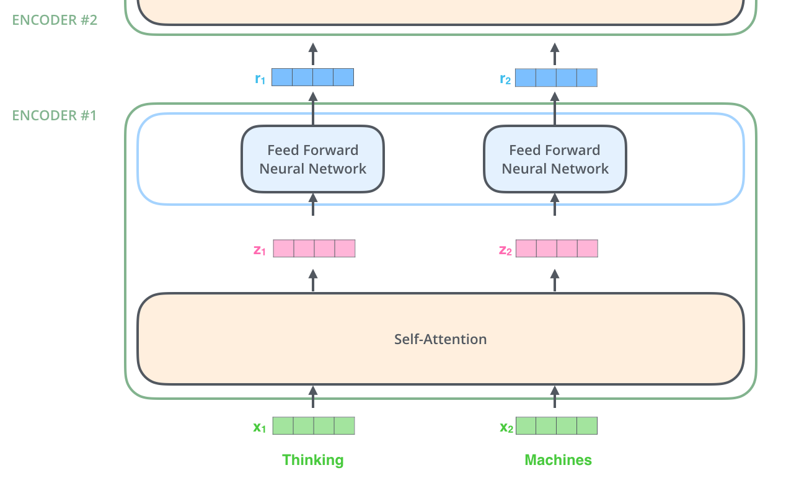

PS：每个位置上的单词都会经过自我注意力处理过程。之后，这些单词又会通过前馈神经网络进行处理——实际上都是同一个网络，只不过每个向量都是单独通过该网络进行处理的。

> **既然每一层的encoder结构都一样：self attention + feed forward network 那为啥要设计那么多层呢？每一层的计算逻辑不都一样吗？这样的意义在哪里呢？**
> 
> 每一层的“计算方法”虽然相同，但“学习目标（参数）”完全不同，且处理的是“不同层次”的抽象信息。
> 1. 核心误区：逻辑相同 ≠ 参数相同：“Self-Attention + FFN”只是宏观的结构骨架，但每一层内部的权重矩阵（W_Q, W_K, W_V 和 FFN 的矩阵）都是独立随机初始化并各自训练出来的。
> 2. 信息处理的“抽象层级”逐渐升高：
> Transformer 的每一层都在对上一层的输出做非线性变换。随着层数加深，数据表征的“语义浓度”越来越高：
>    - 底层（第 1-2 层）—— 词性/句法专家：这一层只关注邻近的词。它的注意力会集中在“主谓宾”结构上，比如发现“苹果”和“吃”有动宾关系，或者识别出“的”字修饰结构。此时的向量还比较“表面”。 
>    - 中层（第 3-4 层）—— 语义/指代专家：这一层开始关注长距离依赖。比如句子开头有“小明”，隔了 50 个词后出现“他”，中层编码器能穿过长距离把“他”指向“小明”。它不再关心词性，而是关心“谁干了什么”。 
>    - 高层（第 5-6 层）—— 全局/意图专家：这一层提炼出整个句子的深层含义。比如它能识别出这句话是“疑问句”还是“反问句”，或者提取出整段话的情感色彩（正面/负面）。这是为最终任务（如翻译、分类）准备的“高度浓缩精华”。
> 3. “全局视野”需要通过堆叠来“逐步磨合”：“自注意力不是一开始就能看到所有词吗？为什么还要堆叠？”
> 虽然第一层自注意力能看到所有词，但它看到的只是“原始词”之间的相似度。它不知道“猫”和“它”在深层语义上是一体的。
>    - 第一层输出：“猫”的向量里融入了“毛茸茸”的特征。 
>    - 第二层接收这个融合后的向量，再计算注意力时，它就能发现“猫+毛茸茸”这一整体概念和“捉老鼠”之间的关联。 
>    - 第三层再往上，就能组合出“这只猫喜欢捉老鼠”这个完整事件的向量。 
> 这就是“逐层抽象”：每一层都在重新组合上一层提取出的“部件”，最终拼凑出复杂的含义。这跟人脑看东西一样——先看线条，再看轮廓，最后识别出人脸。
> 
> 4. 增加模型的“容量（Capacity）”：深度学习的规律：参数量越大，模型能学到的复杂规律就越多。6 层编码器提供了 6 套独立的自注意力参数和 6 套 FFN 参数。
> 有了这些庞大的参数空间，模型才有能力记住人类语言中千变万化的习惯用法和歧义消除规则。

---

## Self-Attention at a High Level 自注意力机制

> 《Attention Is All You Need》：https://arxiv.org/pdf/1706.03762

请说出以下句子是我们想要翻译的输入句子：

```text
The animal didn't cross the street because it was too tired
```

这句话中的“it”指的是什么？是街道还是动物呢？对人类来说这个问题很简单，但对于算法来说却并不容易解答。
当模型在处理“it”这个词时，自注意力机制使其能够将“it”与“动物”联系起来。

当模型处理每个单词（输入序列中的每个位置）时，自注意力机制使其能够关注输入序列中的其他位置，以获取有助于改进该单词编码的线索。

如果你熟悉循环神经网络，那么可以想到，通过保持隐藏状态，循环神经网络能够将其处理过的先前单词或向量的表示与当前正在处理的单词或向量结合起来。
而自注意力机制正是 Transformer 模型用来将其他相关单词的“信息”融入当前正在处理的单词或向量中的方法。

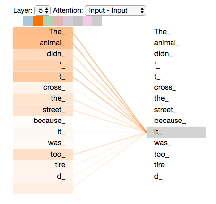

PS：在我们使用第 5 个编码器（堆栈中最顶端的编码器）对“it”这个词进行编码时，注意力机制的一部分注意力被集中在“The Animal”上，因此“The Animal”的某些特征也被纳入了“it”的编码过程中。

> **自注意力机制其实解决一个问题就是在一段文本中代词的具体指向？**
> 
> 从数学本质上讲，自注意力机制解决的是“让任意两个词（无论距离多远）都能直接进行信息交互”。
> 
> 在 RNN（循环神经网络）时代，如果“it”出现在第 100 个位置，而“The Animal”在第 1 个位置，RNN 必须一步步“传话”传 100 步，很容易传丢（梯度消失）。
> 而自注意力让第 100 个词直接“伸手”去拿第 1 个词的特征，无视距离。
> 
> 除了指代，它还用来解决这些问题（举例）：
> - 句法结构：当处理“The old man walked”时，底层的注意力会把“old”指向“man”，用来确定“old”修饰谁，而不是修饰“The”。 
> - 动词主谓一致：处理“The list of many items is...”时，注意力必须让“is”关注到远处的“list”（单数），而不是近处的“items”（复数），以此决定动词形式。 
> - 语义消歧：处理“我打了个车去上班”时，“打”的注意力会分散到“车”上，确定这里是“叫车”而非“揍车”的意思。
> 
> 最重要的认知升级：它不是在“查找”，而是在“融合”：
> 
> 自注意力机制并不做“单选题”。对于高层的“it”，它的注意力权重不是 100% 给“Animal”，而是： 
> - 50% 给 “Animal”（获取实体的单复数、有生命特征）； 
> - 20% 给 句子中的动词（获取动作状态）； 
> - 15% 给 前面句子的主题（获取时态）； 
> - 15% 给 其他词。 
> 
> 所以，“it”最终的编码向量，是整句话所有词特征的加权大杂烩。它不仅“知道了自己指代 Animal”，还“知道了 Animal 正在做什么，以及整句话的情绪”。
>
> 自注意力机制解决的终极问题，是“长距离上下文编码”。而“代词指代”，只是它在高层编码器上表现出来的一种“附带结果”或“可视化证据”。
>
> 正是因为有了自注意力，Transformer 才能看透整个序列，搭建起一张复杂的“词汇关系网”，而网络中的每一个节点（词），最终都汇聚了全网的信息。
> 这才有了那句经典的描述：“Attention is All You Need”（注意力就是一切）。

---

## Self-Attention in Detail 详细解释自注意力机制

我们先来看看如何使用向量来计算自注意力机制，然后再看看其实是如何通过矩阵来实现这一过程的。

**计算自注意力的第一步是从编码器的输入向量中分别生成三个向量（在这种情况下，就是每个词的嵌入向量）。**

因此，对于每个词，我们都会生成一个查询向量（Query vector）、一个键向量（Key vector）和一个值向量（Value vector）。
这些向量是通过将嵌入向量乘以三个矩阵得到的，而这些矩阵是在训练过程中通过训练得到的。

注意，这些新的向量维度比嵌入向量要小。它们的维度为 64，而嵌入向量和编码器输入/输出向量的维度则达到了 512。
其实并不一定非得让这些向量的维度更小，这是架构设计上的选择，目的是使多头注意力计算过程尽可能保持恒定。

> “计算过程尽可能保持恒定”和向量维度之间的关系是什么？
> 
> 这里的“恒定”不是指“计算速度不变”，而是指“无论我们设置多少个注意力头（比如8个、16个），模型的总参数量和总计算量都基本保持不变”。
> - 先看数学关系（破解降维之谜）
> 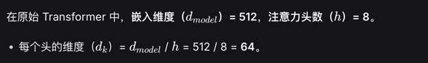
> 关键点来了：多头注意力的本质，是把 512 维的向量切分（Split）成 8 个 64 维的子空间，分别去做自注意力，最后再拼接（Concat）回 512 维。
> - 对比两种极端情况（理解“恒定”）
> 假设我们不把 512 降维成 64，而是每个头都直接处理 512 维（即 8 个头，每个头处理 512 维）：
> 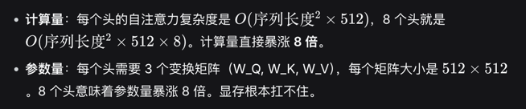
> 而现在的做法（降维到 64）：
> 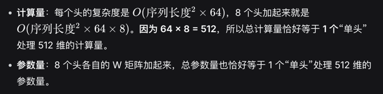
> 结论：引入 8 个头，没有增加任何额外的算力成本，这就是“计算过程尽可能保持恒定”的含义。
> - 为什么要费劲做这种“恒定”设计？（多头的好处）
> **既然计算量没变，为什么要把 512 维切成 8 份，而不直接用 1 个头做 512 维呢？**
> 
> 为了捕捉“不同的语义子空间”。如果只有 1 个头（512维），它只能学出一种“注意力分布”，比如只关注“语法结构”。 
> 
> 分成 8 个头（各64维），虽然总计算量没变，但每个头的 W 矩阵是独立随机初始化的。训练后，这 8 个头会各司其职：
>     - 头 1 可能专注“指代消解”（it → Animal）； 
>     - 头 2 可能专注“相邻修饰”（red → car）； 
>     - 头 3 可能专注“时态”......
> 
> 最后把这 8 个不同角度提取的特征拼起来，比单个头看得更全面。
> 
> 所以，“向量维度更小，怕丢信息”——实际上，信息并没有丢。因为 512 维被均匀拆分后，信息的“总量”不变。缩小维度，是为了给“并行处理（多头）”腾出计算空间，
> 用数学上的等价变换（512 = 8 × 64），换来了模型“多角度观察”的能力，且不增加算力负担。 
> 这就是 Transformer 架构极其精妙的地方：在不增加 FLOPS（浮点运算次数）的前提下，极大丰富了模型的表征能力。

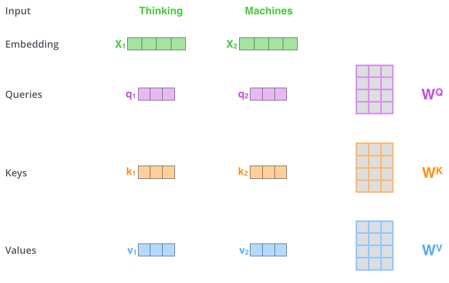

PS：将 x1 与 WQ 权重矩阵相乘后，会得到 q1，即与该单词相关的“查询向量”。最终，我们为每个输入句子中的单词创建了一个“查询向量”、一个“键”以及一个“值”的投影结果。

> **Wq、Wk、Wv 这个三个权重矩阵是随机生成的，包括单词的原始Embedding之后的X词向量也是随机生成的，这里提到了q1 = Wq * X 得出的，那么其他的两个key vector 和 value vector是否也是这样矩阵相乘的出的？**
> 
> 对于输入序列中的同一个词 X，我们通过三个独立且各不相同的权重矩阵，分别进行矩阵乘法，得到三个不同的向量：
> - 查询向量（Query Vector）：q = Wq * X
> - 键向量（Key Vector）：k = Wk * X
> - 值向量（Value Vector）：v = Wv * X
> 
> **为什么必须用三个不同的矩阵？（角色的分工）**
> 
> 如果 Q、K、V 都乘以同一个矩阵（比如都用 Wq），那它们计算出来的数值只是线性变换的倍数关系，在数学上失去了差异性。
> 
> 但在自注意力机制中，Q、K、V 承担的“角色”完全不同：
>   - Q（查询）：它的任务是“我想找什么”（提问者）。
>   - K（键）：它的任务是“我身上有什么标签”（被问者的名片）。
>   - V（值）：它的任务是“我实际携带的内容是什么”（被问者口袋里的知识）。
> 
> 只有用三个独立的矩阵（Wq，Wk，Wv），模型才能在训练过程中，让 Wq 学会“如何问问题”，让 Wk 学会“如何写名片”，让 Wv 学会“如何准备干货”。这三者各司其职，互不干扰。
> 
> 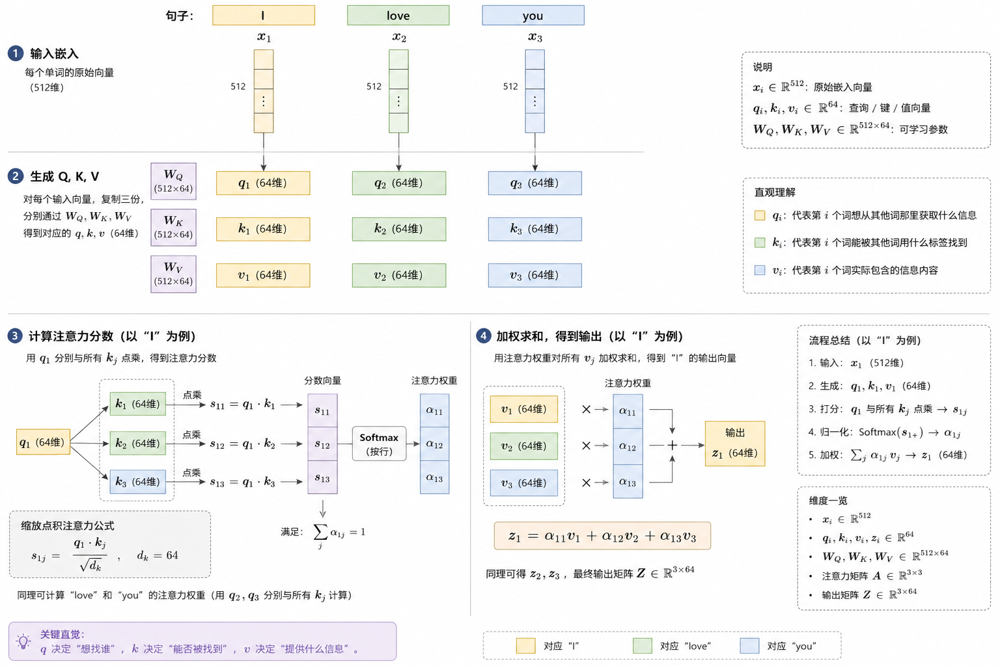
> 

**所谓的“query”、“key”和“value”向量是什么？**

这些概念都是用于计算和分析注意力机制的抽象概念。一旦你继续阅读下面关于注意力如何被计算的内容，你就会了解到这些向量各自所扮演的角色，以及它们在整个系统中的作用。

**计算自注意力的第二步是计算得分。**

假设我们正在计算示例中第一个单词“Thinking”的自注意力。我们需要为输入句子中的每个单词都分配一个得分。这个得分决定了在编码某个位置的单词时，应该关注输入句子中的其他部分多少。

得分的计算方法是将查询向量与每个单词的键向量进行点乘。例如，当我们计算位置为#1 的单词的自注意力时，第一个得分就是 q1 和 k1 的点乘结果。第二个得分则是 q1 和 k2 的点乘结果。

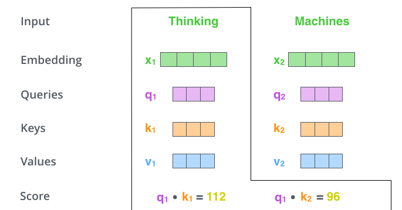

第三步和第四步是：将得分除以 8（即论文中使用的 Key Vector 维度（64）的平方根）。这样能够使得梯度更加稳定。当然，这里还有其他可能的值，但这是默认设置。
之后，将结果通过 softmax 运算进行处理。softmax 运算可以使得所有得分都处于正值范围，并且总和等于 1。

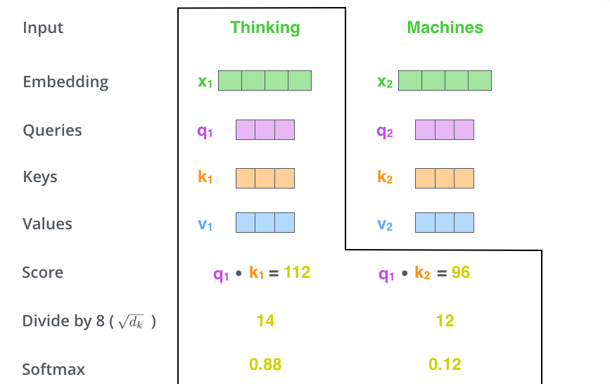

这个 softmax 分数决定了每个单词在这个位置中会被表达出的程度。 **显然，这个位置上的单词会有最高的 softmax 分数。不过，有时候关注与当前单词相关的另一个单词也是很有用的。**

> **不理解：显然，这个位置上的单词会有最高的 softmax 分数。不过，有时候关注与当前单词相关的另一个单词也是很有用的。**
> 
> “显然”并不代表“强制”，这里的“显然”是指数学计算上的自然结果，而“但是”则是指训练后学到的语义倾向。两者并不冲突，而是互补的。
> 
> 1. **为什么它说“显然，这个位置上的单词会有最高的分数”？（数学本能）**
> 
> 这是由点积（Dot Product）的数学性质决定的。在计算注意力分数时，我们是用当前词的 查询向量（q1） 去分别点乘 所有词的键向量（k1, k2, k3...）。
> 
> 点积的物理意义是计算两个向量的相似度。
> 
> 关键点来了：q1 是由 x1 乘以 W_Q 得来的，k1 也是由 x1 乘以 W_K 得来的。虽然 W_Q 和 W_K 不同，但它们都是针对同一个原始词 x1 做的投影。
> 
> 在模型训练的初始阶段或数学直觉上，同一个词投影出来的 q1 和 k1，其向量方向大概率是最接近的（余弦相似度最高）。这就好比用“张三的指纹”去匹配“张三的身份证号”，匹配度天然就是最高的。
> 
> 所以，在大多数情况下（尤其是底层编码器），“自己”和“自己”的匹配分数往往是最高的。这就是它所说的“显然”。
> 
> 2. **为什么它又说“有时候关注另一个单词很有用”？（语义进化）**
> 
> 这就是 Transformer 能够理解上下文的关键所在！虽然数学上“自己匹配自己”最自然，但经过大量语料训练后，权重矩阵 W_Q 和 W_K 被调教得发生了“偏移”。
> 在高层编码器中，会出现一种情况：q1（当前词）与 k2（另一个词）的点积分数，超过了 q1 与 k1 的分数。
> 
> 场景举例：句子是 “The Animal didn't cross the street because it was too tired.”
> 
> 当编码器处理最后一个词 “it” 时，模型已经训练得极为聪明。虽然“it”匹配“it”自己（词本身）的分数可能还有 0.4，但“it”匹配 “Animal”（指代对象）的分数可能飙升至 0.6。
> 此时，“它”这个位置的输出向量，将主要由“Animal”的特征构成，而不是由“它”自己构成。这就是“关注另一个单词”带来的巨大好处——消解了代词指代。
> 
> 3. **Softmax 不是“单选题”**
> 
> 事实上，Softmax 输出的是一个概率分布（权重总和为 1）。它允许：
>   - “自己”占 40%（保留自身词义） 
>   - “Animal”占 35%（获取指代信息） 
>   - “tired”占 15%（获取状态）
>   - 其他词占 10%（获取语境）
> 
> 这句话里“显然”的意思是：通常情况下，自己给自己分配的“门票”权重是最多的那张（类似于基础分）。
> 而“但是”的意思是：虽然自己有基础分，但如果有另一个词在逻辑上更重要，它的分数完全可以通过训练超越“自己”，成为新的主导。

第五步是将每个值向量（Value Vector）乘以 softmax 得分（为之后求和做准备）。这里的思路是保持我们想要关注的单词的值不变，同时通过将无关词汇的得分降为微小数值（例如 0.001）来消除这些无关词汇的影响。

第六步是汇总加权值向量（Value Vector * Softmax得分 之后的向量）。这一步会得出当前位置下自注意力层的输出结果（针对第一个单词）。

> 这里的“汇总加权”指的是 “加权平均（Weighted Average）”
> 
> 在计算“加权”之前，我们做了一步 Softmax。这个操作最关键的作用是：让所有位置的权重分数加起来等于 1（即概率分布）。
> 
> 因为权重总和为 1，所以当我们执行 `权重1 * V1 + 权重2 * V2 + 权重3 * V3` 时，这在数学上就是标准的加权平均（而不是普通的加权求和，普通求和没有归一化这一步）。
> 
> 本质上就是一个“根据全局相关性，对整个序列的信息重新分配并求均值”的过程。

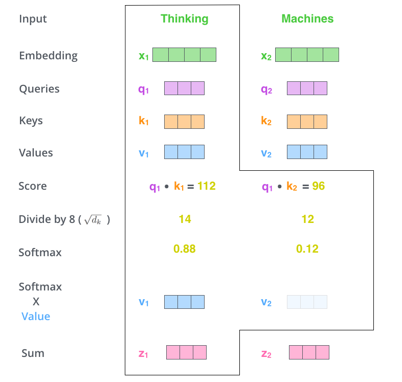

至此，自注意力计算就结束了。得到的向量可以被直接传递给前馈神经网络。不过在实际实现中，这种计算是以矩阵形式进行的，以便实现更快的处理。
现在我们已经理解了在单词级别上进行计算的方式，那么接下来就来看看具体的实现细节吧。

> 总结一下 self attention 的计算步骤有6步：
> 
> ``` text
> 生成Q、K、V -> 计算相似度得分（点积）（用 当前Token的Q * 每一个Token的K）-> 缩放（Scale）（将上一步的得分除以K的维度平方根，防止点积结果过大，导致后续 Softmax 梯度进入饱和区（梯度消失））
> -> 掩码（Mask，可选）在 Decoder 中，将未来位置的分数设为 负无穷（-inf），保证生成时看不到未来单词（仅对解码器自注意力）。
> -> Softmax 归一化（对缩放后的分数按行应用 Softmax，得到注意力权重矩阵（每行权重之和 = 1），代表模型最终分配给每个词的比例）
> -> 加权求和（汇总）将 Softmax 输出的权重矩阵与 V（值） 相乘，对全体 Value 向量做加权平均，融合全局上下文
> ```
> 
> 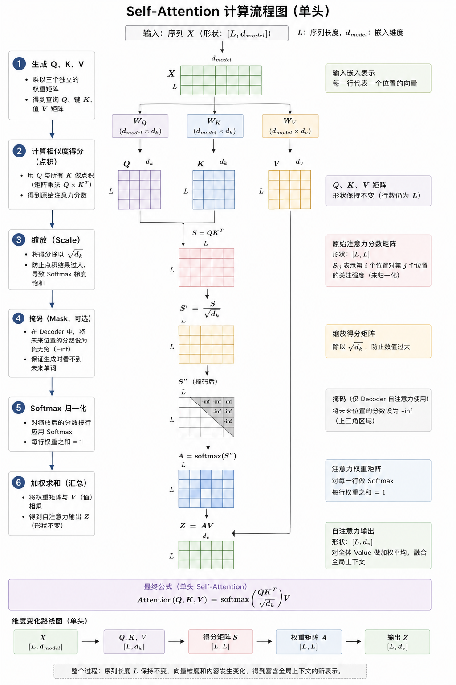

PS：单头 self attention 的计算公式：


---

## Matrix Calculation of Self-Attention 自注意矩阵的计算

第一步是计算查询矩阵（Query Vector）、键矩阵（Key Vector）和值矩阵（Value Vector）。我们通过将嵌入数据打包成矩阵 X，然后将其与我们训练得到的权重矩阵 WQ、WK、WV 相乘来得到这些矩阵。

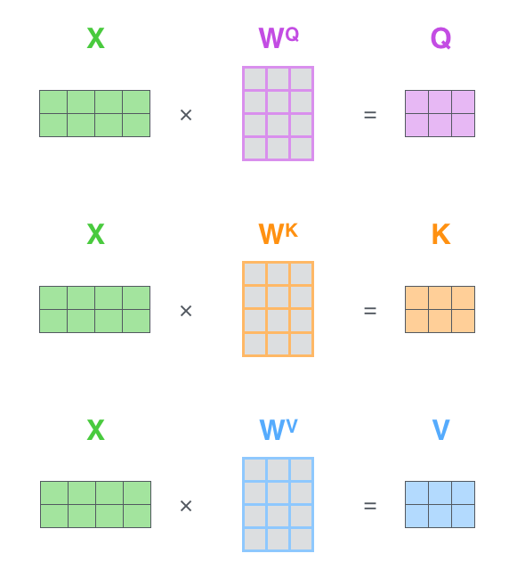

PS：X 矩阵中的每一行对应输入句子中的一个单词。我们再次注意到嵌入向量的大小有所不同（图中为 512，或者 4 个盒子大小）；此外，q/k/v 向量也有差异（图中为 64，或者 3 个盒子大小）。

最后，由于我们处理的是矩阵运算，因此可以将步骤二到六合并成一个公式，以此来计算自注意层的输出结果。

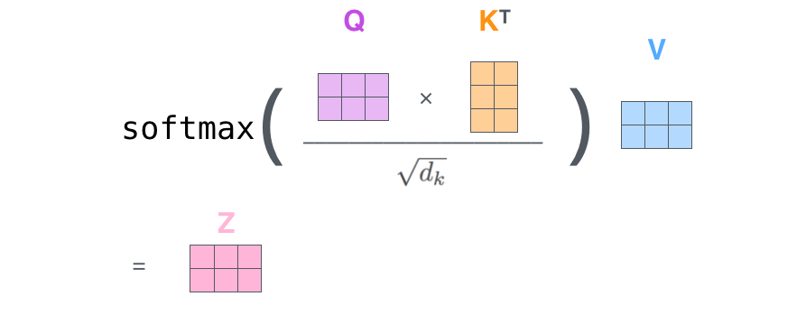

PS：矩阵形式的自注意力计算

---

## The Beast With Many Heads 多头注意力机制

该论文通过引入一种名为“多头”注意力机制的改进，进一步提升了自注意力层的性能。这一改进从两个方面提高了注意力层的效率：

1. 这扩展了模型关注不同位置的能力。当然，在上面的例子中，z1 包含了一些其他编码形式的信息，但这些信息可能会被实际出现的单词所主导。 
例如，在翻译句子“那只动物因为太累了所以没有穿过马路”时，了解“它”指的是哪个单词就非常有用。

2. 这种注意力机制为注意力层提供了多个“表示子空间”。接下来我们会看到，通过多头注意力机制，我们不仅有一组查询/键/值权重矩阵，还有多组这样的权重矩阵
（由于 Transformer 使用了八个注意力头，因此每个编码器/解码器最终拥有八组这样的权重矩阵）。
这些权重矩阵在训练之初都是随机初始化的。而在训练完成后，每组权重矩阵都会被用来将输入嵌入（或者来自较低层编码器/解码器的向量）映射到不同的表示子空间中。

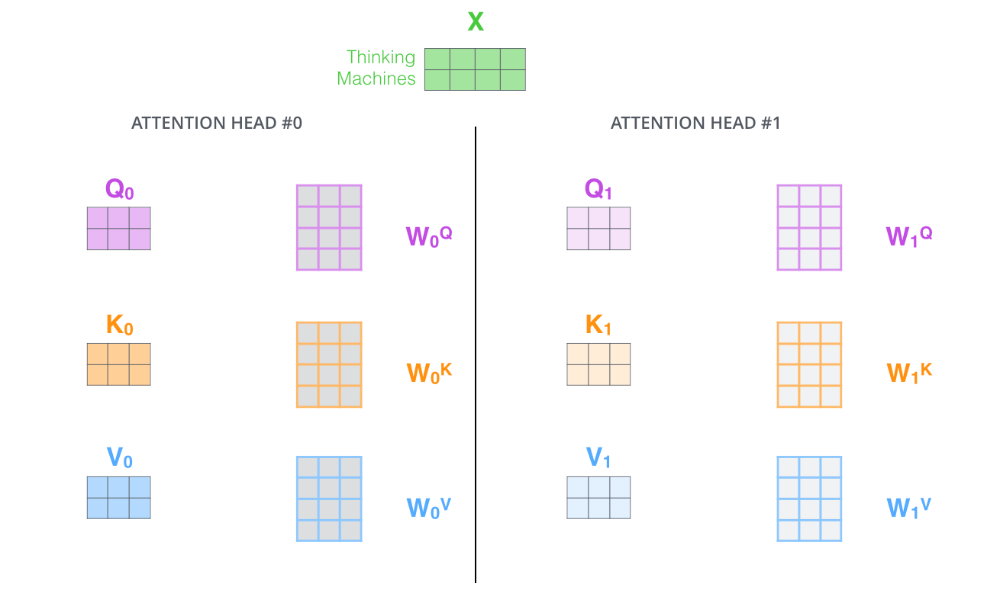

由于注意力分散到多个头部，我们为每个头部分别维护独立的 Q/K/V 权重矩阵，这样就能得到不同的 Q/K/V 矩阵。就像之前一样，我们将 X 与 WQ/WK/WV 矩阵进行相乘，从而得到最终的 Q/K/V 矩阵。

如果我们继续进行上述相同的自注意力计算，即使用不同的权重矩阵进行八次计算，最终会得到八个不同的 Z 矩阵。

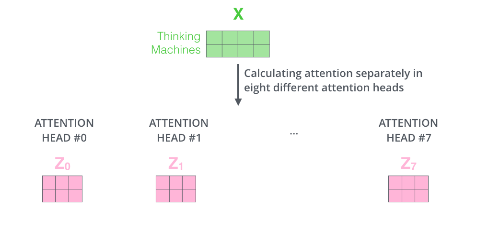

这给我们带来了一些挑战。前馈层并不期望有八个不同的矩阵，而只期望有一个单一的矩阵（每个词对应一个向量）。因此，我们需要一种方法将这些八个矩阵压缩成一个单一的矩阵。

我们该如何实现这一点呢？我们先将各个矩阵连接在一起，然后再将它们与一个额外的权重矩阵 WO 相乘。

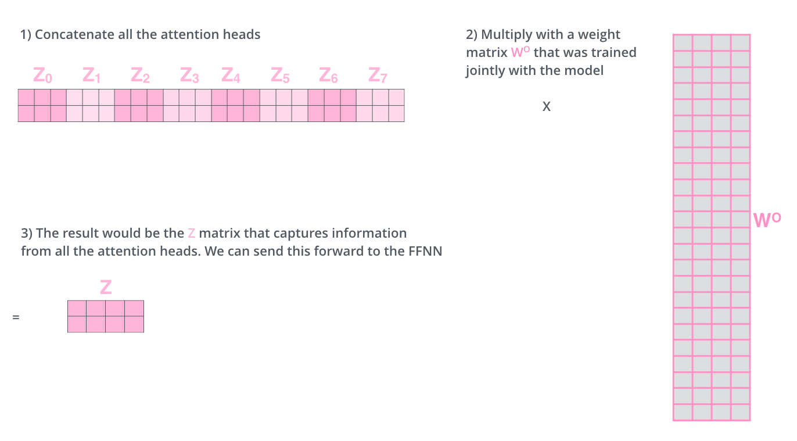

这就是多头自注意机制的全部内容了。不过，我意识到需要使用的矩阵数量相当多。让我试着把它们都展示在一个可视化图中，这样我们就能够集中注意力来看待这些矩阵了。

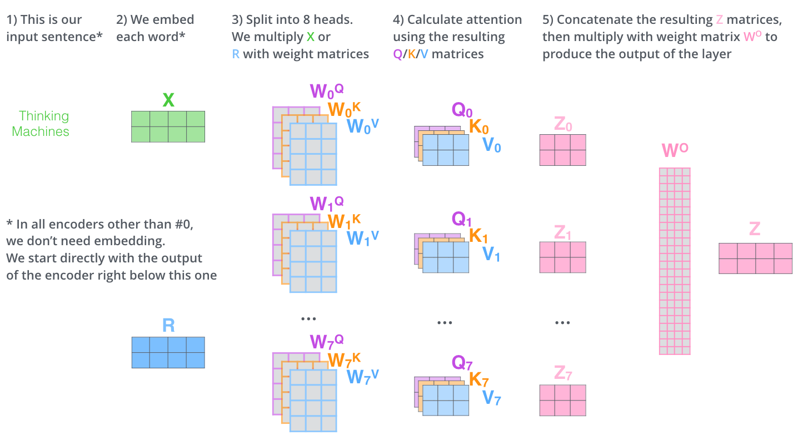

> 多头注意力机制，就是在单一注意力机制上进行相同逻辑的多个计算。
> 
> 比如，8头注意力机制：8个头采用完全相同的计算逻辑（公式），但各自拥有独立且不同的权重矩阵 Wq、Wk、Wv，最终计算出8个Z矩阵。
> 因为8个头的权重矩阵都是独立随机生成的，所以每个头的注意力会集中在不同的Token上，所以提取出的特征值也完全不同。
> 得出来的8个 Z 向量包含了从不同角度提炼的上下文信息。
> 
> 8个Z算完后，会被拼回512维，再经过一层全连接（Wo 权重）融合，才作为最终输出交给前馈网络。
> 

既然我们已经提到了各种注意力焦点，那让我们再来看看之前的例子。现在，当我们在示例句子中编码“it”这个词时，不同的注意力焦点究竟集中在哪些地方呢？

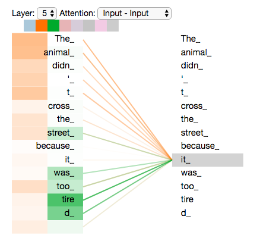

PS：在我们对“it”这个词进行编码时，其中一个注意力焦点集中在“动物”上，另一个则集中在“疲倦”上——从某种意义上说，模型对“it”这个词的表示方式，实际上包含了“动物”和“疲倦”这两个概念的一些特征。

不过，如果我们把所有的关注点都加进去考虑，那么情况可能会变得更加难以解读了：

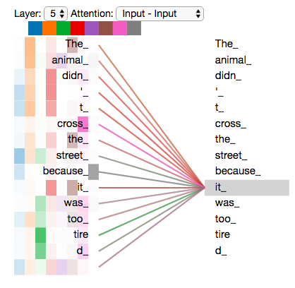

> Transformer 思维：它是分布式表征（Distributed Representation）。它认为“it”的意思不仅由“Animal”决定，还受“tired”、“street”乃至整句话的所有词影响。
> 因此，它会把全体词的特征按不同比例（哪怕只有0.01%）都融入到“it”中。
> 
> **最终的完整的计算逻辑：**
> 
> 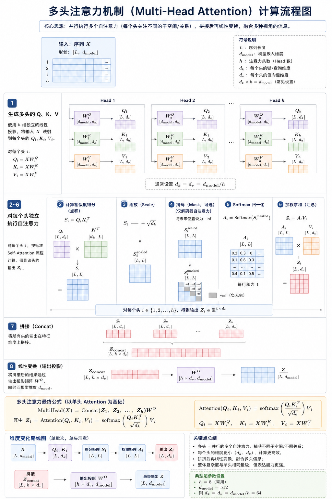

---

## Representing The Order of The Sequence Using Positional Encoding 使用位置编码来表示序列的顺序

在我们目前所描述的模型中，有一件事缺失了，那就是无法考虑到输入序列中单词的排列顺序。

为了解决这个问题，变压器在每个输入嵌入中添加了额外的向量。这些向量遵循一种特定的模式，模型通过学习这种模式来识别每个单词的位置，或者序列中不同单词之间的距离。
这里的直觉是，将这些值添加到嵌入中后，当嵌入向量被投影为 Q/K/V 向量时，以及在进行点乘注意力计算时，就能得到有意义的单词间距离。

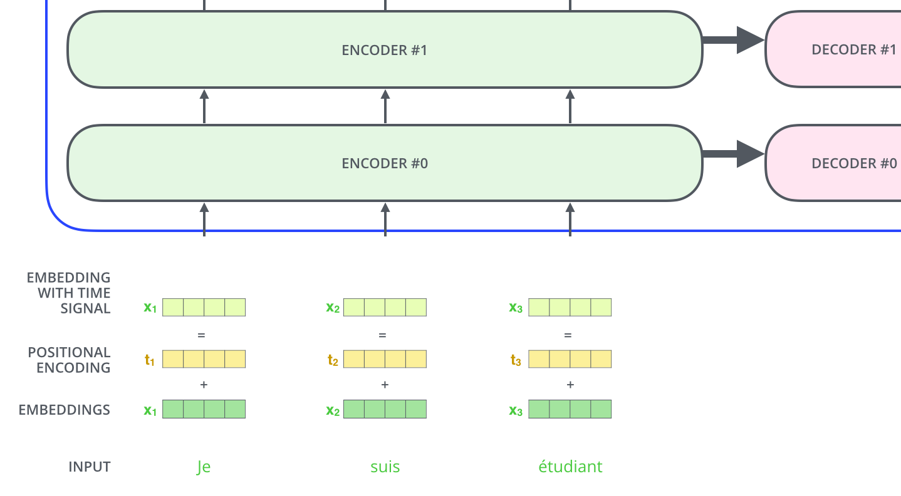

PS：为了让模型能够理解词语的顺序，我们添加了位置编码向量——这些向量的数值遵循特定的模式。

如果我们假设嵌入的维度为 4，那么实际的位置编码就会呈现如下样子：

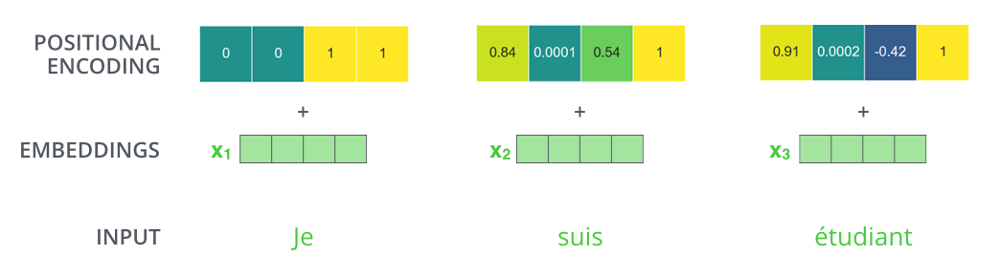

PS：一个实际的位置编码示例，其中嵌入维度为 4

这种模式可能会是什么样子的呢？

在下面的图中，每一行对应一个向量的位置编码。因此，第一行所表示的向量将被添加到输入序列中第一个词的嵌入中。
每一行包含 512 个值，每个值的范围在 1 到-1 之间。我们使用了颜色编码来使这些模式更加明显。

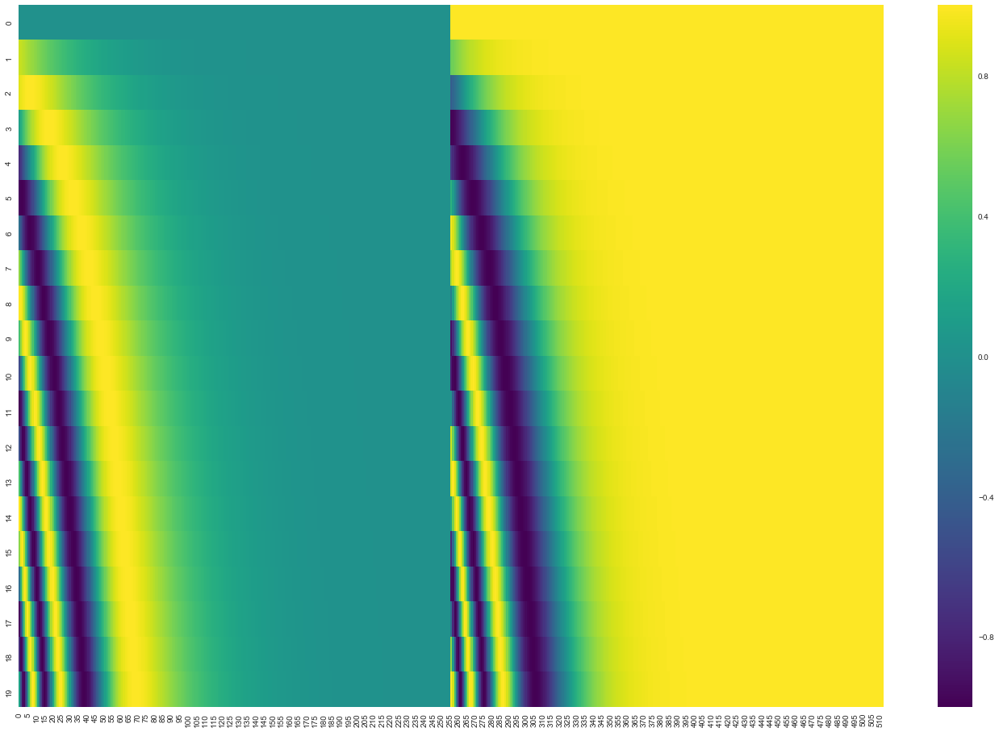

PS：这是一个典型的位置编码示例，包含 20 个单词，每个单词对应一个编码向量。编码向量的嵌入大小为 512，即每个向量包含 512 个特征。
你可以看到，这些向量在中间被分成了两半。这是因为左半部分的特征是由某个函数生成的（该函数使用正弦函数），而右半部分的特征则是由另一个函数生成的（该函数使用余弦函数）。
这两个部分的特征随后被连接起来，从而形成最终的编码向量。

位置编码的公式在论文中有所描述（第 3.5 节）。你可以在 get_timing_signal_1d() 中找到用于生成位置编码的代码示例。这并不是位置编码的唯一方法。
不过，这种方法的一个优点是能够适应不同长度的序列（例如，如果我们的训练模型需要翻译比训练集中的句子更长的文本）。

> **仅仅是把一个向量（位置编码）加到了词向量（Embedding）上，模型怎么就‘知道’顺序了？难道不会把语义和位置信息搞混吗？**
> 
> 1. 物理实现：它是怎么“塞”进去的？（加法注入）
> 
> 位置编码不是拼接（Concat），而是直接相加（Element-wise Addition）。
> 
>   - 词嵌入（Word Embedding）是一个 512 维的向量。
>   - 位置编码（Positional Encoding）也是一个 512 维的向量。
>   - 最终输入 = 词嵌入向量 + 位置编码向量（对应维度直接加）。
> 
> **相加不会破坏原来的词义吗？**
> 
> 不会。因为 512 维空间是一个高维空间。这就像在三维空间中，(x, y) 代表平面位置，z 代表高度。你可以把 x+y 相加得到一个新值，但在这个高维空间里，
> 模型完全有能力把“语义信号”和“位置信号”分配到不同的维度子空间里去。甚至在早期，模型可能会把位置信号当作一种“高频噪声”，通过后续的注意力机制将它们分离出来。
> 
> 2. 模型是怎么“读取”这个顺序的？（关键！通过 Q·K 点积）
> 
> 模型并不会主动去“看”这个数字是几，它是在计算自注意力（Q * K^t）的过程中被动地感知到了顺序。假设有两个词，位置分别是 pos 和 pos + k 相隔 k 个位置，它们的最终输入向量分别是：
> 
> 
> 
> 当计算这两个词的注意力分数时，需要做点积 Xpos . Xpos+k。展开这个点积，其中有一项就是 PEpos . PEpos+k （位置编码之间的点积）
> 
> 三角恒等式的魔法来了：由于 PE 是用 Sin/Cos 定义的，数学上可以证明：PEpos . PEpos+k 的结果，仅仅取决于间隔 k（相对距离），而完全与绝对位置无关！
> 
> 当模型计算“我”和“你”的注意力分数时，这个分数里天然就自带了一个“距离折扣因子”。如果两个词离得近（k 小），这个乘积结果大；如果离得远（k 大），这个乘积结果小（或呈周期性变化）。
> 
> 模型根本不需要显式地去“查”位置表。它只需要做矩阵乘法，乘法的结果里就已经包含了“相对距离”的信息。这就是位置编码的终极目的——把“顺序”转化为“可计算的数值特征”，注入到注意力分数的计算中。
> 
> 位置编码并不是给单词贴了个“第几名”的标签，而是给每个位置生成了一个独一无二的“空间指纹”。
> 这个指纹通过“加法”融入到词向量中，并在后续计算点积时，自然地把“距离远近”作为权重的一部分，参与到了注意力分数的计算里——顺序，就是这样被“算”出来的，而不是被“看”出来的。
> 
> Transformer 把位置编码直接加到词向量上，相当于给每个词戴了一块“高精度的 GPS 坐标手表”。虽然手表和衣服都穿在身上（相加），
> 但在后续计算亲密关系（注意力分数）时，模型会同时参考“衣服颜色（语义）”和“手表距离（位置）”，最后加权求和得出综合亲密度。
> 位置信息从未丢失，它作为一项独立的“加减分项”，直接决定了每个词对其它词的关注程度。

2020 年 7 月的更新：上述位置编码方式源自 Tensor2Tensor 对 Transformer 的实现。（https://github.com/jalammar/jalammar.github.io/blob/master/notebookes/transformer/transformer_positional_encoding_graph.ipynb）
论文中描述的方法略有不同，它并非直接拼接两个信号，而是将它们相互交织在一起。

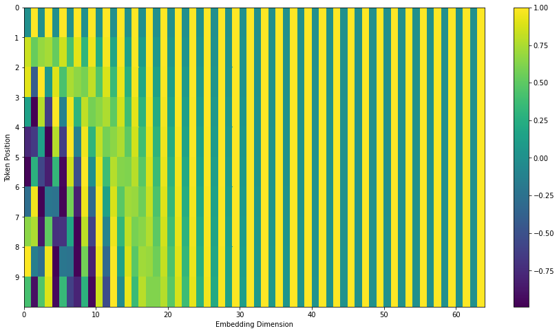

> - 原始论文（“交织”/Interleaving）：按照维度下标的奇偶性，交替使用sin和cos函数。也就是说，位置编码向量的第0维用sin，第1维用cos，第2维用sin，第3维用cos……以此类推，两种信号是相互“交织”在一起的。 
> - Tensor2Tensor（“拼接”/Concatenation）：将维度一分为二，前半部分全部使用sin函数，后半部分全部使用cos函数。即向量的 `[0 : d_model/2]` 维是sin的结果， `[d_model/2 : d_model]` 维是cos的结果，两者是前后“拼接”在一起的。

---

## The Residuals 残差 

在介绍后续内容之前，我们需要提到一个关于编码器架构的细节：每个子层（如自注意力、FFNN 等）都包含了一个残差连接，并且在每个子层之后还有一个层归一化步骤。

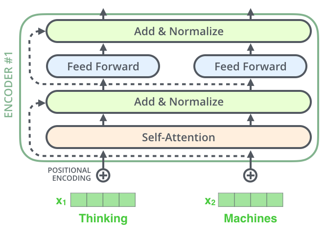

如果我们想要形象化自注意所涉及的向量以及层归一化操作，那么其样子应该是这样的：

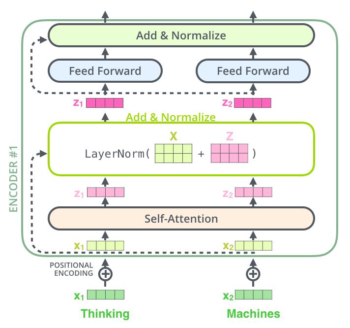

这同样适用于解码器的各个子层。如果我们把 Transformer 看作是由两个堆叠的编码器和解码器组成的系统，那么它的结构大概是这样的：

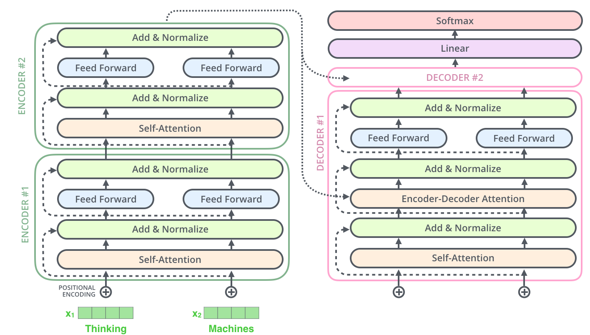

> **残差连接（Residual Connection）的数学公式极其简单： 输出 = 输入 + 子层(输入)**
> 
> PS：输出 = 原值+增量（维度不变，对应位置元素相加）
> 
> 在Transformer编码器中，具体表现为：
> 
> - 输出 = 层归一化( 输入 + 自注意力(输入) )
> - 输出 = 层归一化( 输入 + FFN(输入) )
> 
> 注意这个 “+ 输入”，它就是把输入原封不动地“抄”一份，直接加到经过自注意力处理后的结果上去，再一起交给归一化层。
> 
> 假设没有残差连接（即输出 = 子层(输入)），每一层都相当于一个“重写机”。数据每经过一层，原始信息就被彻底改写成新的向量。
> 可能已经被后面复杂的句法、指代信息冲得面目全非，甚至完全消失了。这就是深度学习中的“信息退化”。
> 
> 加上残差连接后，相当于每一层都在说：“我不彻底重写你，我只写下我发现的‘修改建议’，然后直接加到你的原稿上。
> 
> **核心作用是：**
> 
> - 解决“梯度消失”（训练时的急救通道）：
> 这是最数学本质的原因。神经网络是靠“反向传播（链式法则）”来更新参数的。如果网络很深，梯度需要从最后一层一层层乘回去。
>   - 没有残差：梯度连乘时，如果乘数小于1，梯度越乘越小，最后变为0（消失），前几层根本学不到东西，模型训不动。
>   - 有了残差：反向传播时，导数变成了 1 + 子层的导数。那个 “+1” 就像一条直达电梯，让梯度可以不经过任何复杂的矩阵乘法，直接从顶层无损地送回最底层。这就保证了底层的权重也能被有效更新。
> - 作用二：让模型变成“差分机”（降低学习难度）
> 如果没有残差，每一层必须学会一个完整的复杂函数 F(x)（比如从“苹果”直接映射到“苹果被吃了”）。
> 如果加了残差，每一层只需要学会微小的调整 Δ（Delta）。因为 F(x) = x + Δ(x)。
>   - 对于模型：学会“把向量稍微往右偏一点点”远比学会“把向量重写一遍”要简单得多。
>   - 经典案例：如果某一层发现“加了这一层对结果没帮助”，在残差机制下，它只需要把所有权重训练成 0，输出 = 输入 + 0 = 输入。这一层就变成了“恒等映射（空气层）”，直接放数据通过，不影响前面学好的成果。这使得堆叠非常多层的风险被降到最低。
> 
> 残差连接 = 给数据保留原始底稿 + 给梯度修建直达电梯。它让每一层只需要学习“微小的修正增量”，从而使得堆叠极其深层的网络变得可能且高效。
> 
> 在Transformer里，自注意力负责“找关系”，前馈网络负责“深思考”，而残差连接负责“保命（保原始信息）”。
> 

---

## The Decoder Side 解码器端

现在我们已经介绍了编码器方面的大部分概念，基本上也了解了解码器的各个组件是如何工作的。不过，让我们来看看它们是如何协同工作的吧。

编码器首先处理输入序列。顶部编码器的输出会被转换为一组注意力向量 K 和 V。这些向量将被每个解码器在其“编码器-解码器注意力”层中使用，以帮助解码器专注于输入序列中的适当位置。

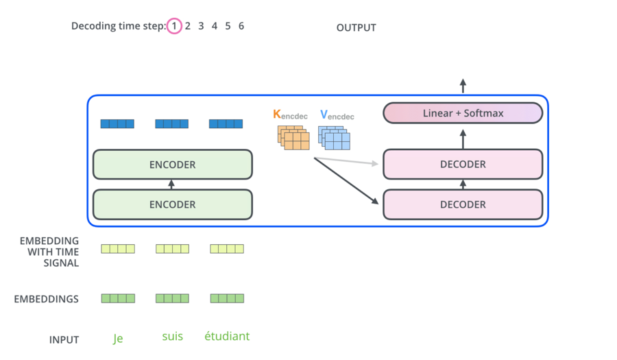

> **Encoder 最终的输出结果是什么？顶部编码器的输出会被转换为一组注意力向量 K 和 V 这里的 K 和 V 到底是什么？**
> 
> 顶部编码器输出的是一个矩阵：假设输入句子有 L 个单词，词向量维度是 512，那么输出就是一个 `[L,512]` 的矩阵。
> 这个矩阵里包含了 L 个向量，每个向量都代表对应位置的单词。但请注意，这时的向量已经不再是原始的词义，而是融合了整句话上下文后的深层语义特征（比如：“it”的向量里已经混入了“Animal”和“tired”的特征）。
> 
> 就是解码器即将查阅的那份 K 和 V 的母本，被记做 Encoder 最终输出 H。
>
> **⚠️ 注意：需要重点区分这里的 K V 不是Encoder中的 Key Vector 和 Value Vector！！！**
> 
> 这里的 K V 是解码器交叉注意力阶段，在解码器（Decoder）内部的交叉注意力层（Encoder-Decoder Attention）。由顶部编码器输出的最终特征计算得出。
> 
> **如何从 H 计算出 K V？**
> 
> 编码器的输出 H 只是一份安静的“静态参考资料”。它被复制了 N 份（N 等于解码器的层数），分别送入解码器的 每一层。真正的 K,V 计算，发生在解码器内部的交叉注意力（Encoder-Decoder Attention）子层里。
> 
> 当 H 进入解码器的某一层（比如第 3 层）时，该层会执行以下操作：
> 
> 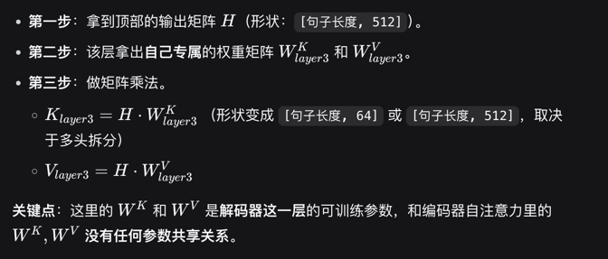
> 
> 每一层都进行相同规则的计算逻辑。

PS：在完成编码阶段之后，我们开始解码阶段。在解码阶段中，每一步都会输出一个来自输出序列的元素（在这种情况下，就是英文翻译后的句子）

接下来的步骤会重复这一过程，直到遇到一个特殊符号，这表明变压器解码器已经完成了其输出任务。每个步骤的输出都会被传递到下一个时间步骤中的底部解码器，而解码器会像编码器一样上报他们的解码结果。
就像我们对编码器输入所做的那样，我们也会对这些解码器的输入进行嵌入处理，并添加位置编码，以表明每个单词的位置。

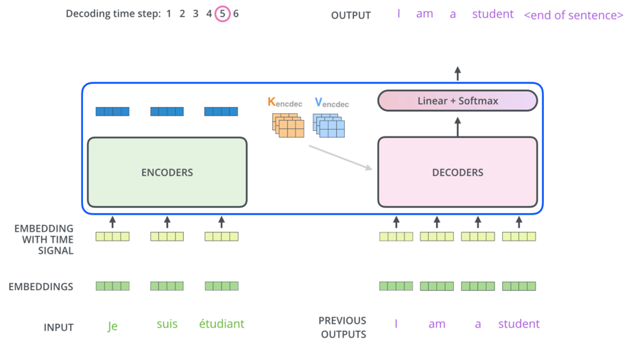

解码器中的自我关注层的工作方式与编码器中类似的部分略有不同：

在解码器中，自注意力层仅允许关注输出序列中更早的位置。这是通过在自注意力计算过程中的 softmax 步骤之前将未来的位置标记为 -inf 来实现的。

“编码器-解码器注意力”层的工作原理与多头自注意力类似，不过它从下方的层中获取查询矩阵，而从编码器堆栈的输出中取得键和值矩阵。

---

## The Final Linear and Softmax Layer 最后的线性层和全连接层

解码器堆栈最终输出一个浮点数值向量。那么，如何将这个向量转换为实际的单词呢？这一任务由最后的线性层来完成，之后则是 Softmax 层。

线性层是一个简单的全连接神经网络，它将由一系列解码器产生的向量映射成一个规模大得多的向量，这个向量被称为“逻辑向量”。

我们假设我们的模型掌握了 10,000 个独特的英语单词（这些单词就是模型的“输出词汇表”）。这样一来，logits 向量就会有 10,000 个元素——每个元素对应一个独特单词的得分。这就是我们在经过线性层处理后对模型输出的理解方式。

softmax 层随后将这些分数转化为概率值（所有概率均为正，且总和等于 1.0）。选择概率最高的那个 cell 所对应的单词，作为当前时间步的输出结果。

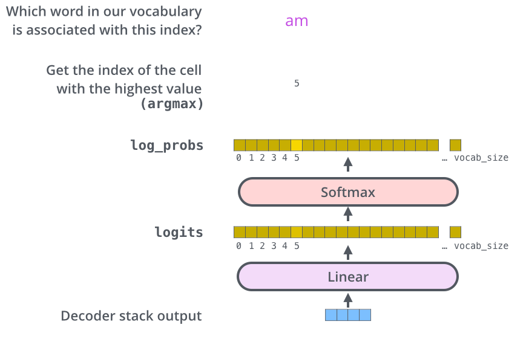

PS：这个图形从底部开始，其中产生的向量作为解码器堆栈的输出。之后，它会被转化为一个输出单词。

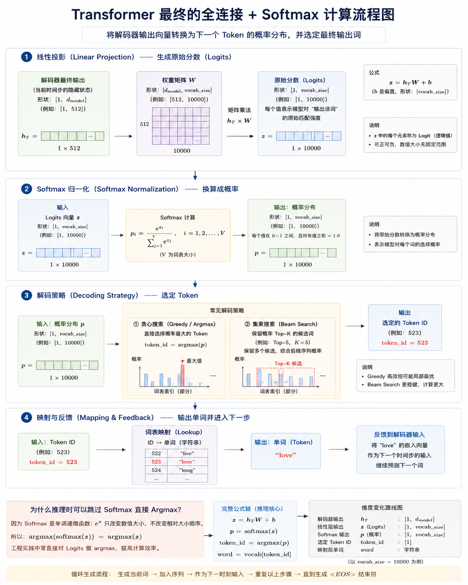

---

## Recap Of Training 训练概括

